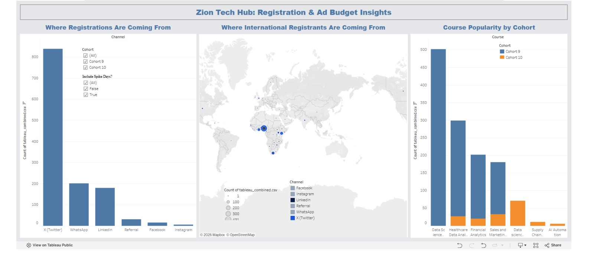

# Zion Tech Hub: Ad Budget & Growth Analysis

## Overview
This project analyzes real registration data from two cohorts (Cohort 9 and Cohort 10) of Zion Tech Hub's training program, covering courses including Data Science and AI, Healthcare Data Analytics, Financial Analytics, and Sales and Marketing Analytics, submitted as part of the Zion Tech Hub Data Challenge.

Unlike a typical portfolio project built on a pre-cleaned Kaggle dataset, this analysis works with actual sign up form exports pulled directly from a live business. The data reflects everything that comes with real world collection: inconsistent phone number formats, free text country entries, a missing occupation field in one cohort, duplicate entries, and messy timestamps. None of it was cleaned or prepared in advance. Part of the work here was deciding, and documenting, what counted as noise versus signal.

Zion Tech Hub was preparing to launch its first ever paid advertising campaign, with no prior ad history to draw on. The only available evidence for where to invest that budget was sitting inside this registration data. This project treats that as the real business problem it is, not an academic exercise, but a recommendation a real marketing lead would need to act on.

**The core questions this analysis answers:**
- Where should ad budget be allocated, and to which audiences?
- What should change, beyond advertising, to grow the community and fill the next cohort?

Every recommendation in this project is tied directly to a specific, traceable pattern in the data, not a general assumption.

## Data

- `data/raw/` : original, untouched exports (Cohort 9: 1,092 registrations, Cohort 10: 171 registrations)
- `data/processed/` : cleaned versions used for analysis

## Tools Used

Python, pandas, numpy, matplotlib, seaborn, Jupyter Notebook (VS Code)

## Project Structure

```
zth-ad-budget-analysis/
├── data/
│   ├── raw/
│   │   ├── cohort_9_raw.csv
│   │   └── cohort_10_raw.csv
│   └── processed/
│       ├── cohort9_clean.csv
│       ├── cohort10_clean.csv
│       └── tableau_combined.csv
├── notebooks/
│   ├── 01_data_inspection.ipynb
│   ├── 02_exploratory_analysis.ipynb
│   └── 03_dashboard.ipynb
├── outputs/
│   ├── chart1_channel_comparison.png
│   ├── chart2_geo_channel_mix.png
│   ├── chart3_course_shift.png
│   ├── chart4_timing_spikes.png
│   ├── dashboard_combined.png
│   └── tableau_dashboard_preview.png
├── presentation/
│   └── Zion_Tech_Hub_Ad_Budget_and_Growth_Recommendations.pdf
├── reports/
│   ├── assumptions.md
│   ├── findings_summary.md
│   └── recommendations.md
├── .gitignore
├── GIT_WORKFLOW.md
├── README.md
└── requirements.txt
```


## How to Run

1. Clone this repo
2. Create a virtual environment and install dependencies: `pip install -r requirements.txt`
3. Open the notebooks in `notebooks/` in order

## Key Findings

- **Raw channel numbers are misleading.** X (Twitter) appears to dominate (62.7% of Cohort 9), but 41.8% of that cohort registered in a single 2-day window (Jan 22-23), 91% of it through X (Twitter) alone. With that spike removed, X (Twitter) still leads but far less dramatically (39.6%), and is genuinely growing across cohorts (up to 62.8% spike-adjusted in Cohort 10).
- **LinkedIn is the most stable, predictable channel** across both cohorts (24.8% to 23.3%), and brings in nearly double the share of Healthcare Data Analytics registrants compared to X (Twitter).
- **WhatsApp is declining sharply** (28.9% to 7.0%, spike-adjusted) and is close to a Nigeria-only channel, barely reaching international registrants.
- **International interest is real and repeatable.** Nigeria, South Africa, Ghana, and Kenya are consistently the top four countries across both cohorts. International registrants use X (Twitter) and LinkedIn at higher rates than Nigerian registrants, and rarely use WhatsApp.
- **Course preferences are shifting.** Data Science and AI/ML remains the most popular track (steady at ~46%). Sales and Marketing Analytics grew (+8.5 points), while Healthcare Data Analytics genuinely declined (-6.7 points), even after controlling for Cohort 10's expanded course catalog.
- **Nearly two-thirds of repeat registrants switched their course choice** the second time, suggesting people aren't always confident in their first pick, a funnel clarity issue, not a data quality one.

Full reasoning and evidence: [`reports/findings_summary.md`](reports/findings_summary.md)

## Recommendations

**Ad budget allocation:** 55% X (Twitter), 30% LinkedIn, 10% test budget on Facebook/Instagram reactivation, 5% referral incentives. No budget recommended for WhatsApp as an acquisition channel given its steep decline.

**Growth actions for Cohort 11:**
1. Clarify course selection upfront to reduce registration switching
2. Investigate the cause of WhatsApp's decline before deciding its future
3. Plan a deliberate, timed push near the registration deadline (both cohorts show this converts heavily)
4. Build a structured referral program around LinkedIn's stable, returning audience
5. Investigate the Healthcare Data Analytics decline before it affects LinkedIn's performance
6. Treat international growth as an X (Twitter)/LinkedIn play, not a WhatsApp one

Full allocation reasoning and numbered detail: [`reports/recommendations.md`](reports/recommendations.md)

## Live Interactive Dashboard

An interactive Tableau dashboard is published here, allowing live filtering by cohort and toggling spike-driven registration days on or off:

**[View the live dashboard on Tableau Public](https://public.tableau.com/app/profile/kofoworola.agbede/viz/ZionTechHub-AdBudgetGrowthDashboard/ZTH_Ad_Budget_Dashboard)**


